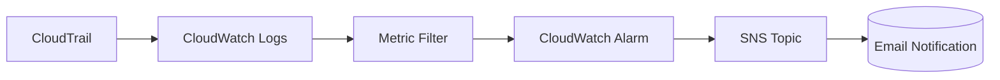

# 📜 CloudTrail + CloudWatch + SNS Monitoring (Terraform)

This Terraform configuration sets up an **alerting pipeline** to detect when **AWS Systems Manager (SSM) Parameter Store** parameters are accessed via the `GetParameter` API.

---

## 🛠️ System Components

- **CloudTrail** → Captures API calls  
- **CloudWatch Logs & Metric Filters** → Detects specific events  
- **CloudWatch Alarms** → Triggers on suspicious activity  
- **SNS** → Sends notifications via email  

---

## 🗂 Project Structure

```text
.
├─ providers.tf   # AWS provider, region, and identity data
├─ cloudtrail.tf  # CloudTrail setup + S3 bucket + IAM role/policies
├─ cloudwatch.tf  # Log group, metric filter, and alarm definition
├─ sns.tf         # SNS topic and email subscription
```

---

## ⚙️ What This Does

### 🔹 CloudTrail
- Creates an **S3 bucket** for CloudTrail logs  
- Configures CloudTrail to **capture API activity**  
- Sends logs to a **CloudWatch Log Group**  

### 🔹 CloudWatch
- Creates a log group for CloudTrail events  
- Defines a **metric filter** for SSM `GetParameter` calls:

```json
{ ($.eventSource = "ssm.amazonaws.com") && ($.eventName = "GetParameter") }
```

- Sets up an **alarm** when ≥ 1 `GetParameter` event occurs within 1 minute  

### 🔹 SNS
- Creates an SNS topic  
- Subscribes your email for alerts  

---

## 📦 Prerequisites

- [Terraform](https://developer.hashicorp.com/terraform/downloads) v1.5+  
- [AWS CLI](https://docs.aws.amazon.com/cli/) configured with credentials  
- A **globally unique** S3 bucket name for CloudTrail logs  
- A **valid email** for SNS subscription  

---

## 🚀 Deployment

1. **Set variables** in `variables.tf` or override at runtime:

```hcl
variable "cloudtrail_bucket_name" {
  default = "your-unique-cloudtrail-bucket"
}

variable "sns_email" {
  default = "your-email@example.com"
}
```

2. **Initialize & apply**:

```bash
terraform init
terraform apply
```

3. **Confirm SNS subscription** in your email inbox  

> ⚠️ Until you confirm, alarms won’t notify you.  

---

## 🧪 Testing

1. Run:

```bash
aws ssm get-parameter --name <your-parameter-name>
```

2. Go to **CloudWatch → Metrics → GetParameterCountNamespace → GetParameterCount**  

3. Within ~1 min the **alarm** should enter `ALARM` state and send you an email  

---

## 📤 Outputs

After a successful `terraform apply`, you’ll see:

- `cloudtrail_bucket_name` → S3 bucket for CloudTrail logs  
- `cloudwatch_log_group` → Log group for CloudTrail events  
- `sns_topic_arn` → SNS topic ARN  

---

## 🧹 Cleanup

```bash
terraform destroy
```

---

## 🔒 Notes & Next Steps

- Log group retention = **90 days** (customizable)  
- Extend with more metric filters:
  - Unauthorized API calls → `{ $.errorCode = "AccessDenied*" }`  
  - Console logins → `{ $.eventName = "ConsoleLogin" }`  
  - Root user usage → `{ $.userIdentity.type = "Root" }`  
- SNS can forward to Slack, PagerDuty, or Lambda  

---

## 📊 Architecture Overview



---

✅ With this setup you now have an **auditable, automated alerting system** for sensitive SSM Parameter Store usage.
